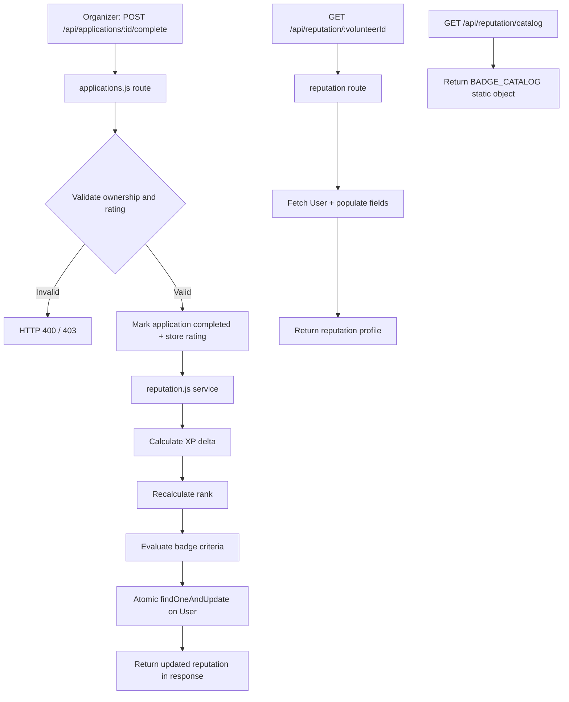

# Design Document — Volunteer Reputation & Badges

## Overview

This feature adds a persistent reputation layer to EventHive. Volunteers accumulate XP and unlock themed badges by completing events and receiving organizer ratings. Reputation data lives as an embedded sub-document on the User model, keeping reads cheap and document size bounded. Organizers see a volunteer's rank and top badges when reviewing applications, enabling informed selection decisions.

The system is intentionally lean: no separate reputation collection, no aggregation pipelines, no external image assets. Badge definitions are a static in-memory catalog. All reputation mutations flow through a single service module called after an application is marked complete.

---

## Architecture



The reputation service is a pure utility — it receives the current volunteer document and the completion event, computes the new state, and returns an update object. The route applies it atomically via `findOneAndUpdate`. This keeps the service unit-testable without a live database.

---

## Components and Interfaces

### server/services/reputation.js

The core logic module. Exports pure functions and one orchestrator:

- `calculateXP(currentXP, rating)` — adds 50 base XP, plus 10 if rating === 4, plus 25 if rating === 5. Returns new total.
- `calculateRank(xp)` — maps XP to rank string using the six-tier threshold table.
- `evaluateBadges(volunteer, newXP, newEventsCompleted, eventId)` — checks each BADGE_CATALOG criterion against new state, filters out already-held badges, returns array of new badge objects.
- `buildReputationUpdate(volunteer, rating, eventId)` — orchestrates the above, returns a MongoDB `$inc`/`$set`/`$push` update object ready for `findOneAndUpdate`.

### server/services/badgeCatalog.js

Static module exporting `BADGE_CATALOG` — an array of 9 badge definition objects:

```js
{
  id: String,          // e.g. 'first_step'
  name: String,        // e.g. 'First Step'
  description: String,
  criterion: String,   // human-readable threshold
  svgPath: String      // inline SVG path d= value, 24x24 viewBox
}
```

No database reads. Imported by the reputation service and the catalog route.

### server/routes/reputation.js

- `GET /api/reputation/catalog` — public, no auth required, returns full `BADGE_CATALOG`
- `GET /api/reputation/:volunteerId` — protected; returns volunteer reputation; includes `fullName`, `profilePic`, `skills` when requester role is `organizer`

### server/routes/applications.js (extended)

New endpoint added to the existing router:

- `POST /api/applications/:id/complete` — organizer-only; validates ownership, validates rating, calls `buildReputationUpdate`, applies atomic update, returns updated reputation

### client/src/js/reputation.js

New frontend module:

- `loadReputation(token)` — fetches `/api/reputation/:myId` and `/api/reputation/catalog`, then calls render functions
- `renderReputationSection(reputation, catalog)` — injects XP bar, rank chip, earned badge icons into `#reputation-section`
- `renderProgressPanel(reputation, catalog)` — populates the Progress Panel overlay with all badges and progress indicators
- `getProgressPercent(xp, rank)` — returns 0–100 progress within the current rank tier

### client/home.html (extended)

A new `<section id="reputation-section">` is inserted before the existing event sections. It contains:

- Rank chip coloured by tier
- XP progress bar with numeric label
- Row of earned badge SVG icons at 32×32
- Info (i) icon button that opens the Progress Panel overlay

A `<div id="progress-panel">` overlay is added at the bottom of `<body>`. An SVG `<defs>` sprite block is injected once into the page containing all 9 badge symbol definitions, referenced via `<use href="#badge-{id}">`.

### client/organiser.html (extended)

The applicant list gains **Rank** and **Badges** (top 3 SVG icons) columns. Clicking a row opens a detail panel showing full reputation data fetched from `/api/reputation/:volunteerId`.

---

## Data Models

### User.js — reputation sub-document added to userSchema

```js
reputation: {
  xp:              { type: Number, default: 0 },
  rank:            { type: String, default: 'Newcomer' },
  eventsCompleted: { type: Number, default: 0 },
  badges: {
    type: [{
      badgeId:   { type: String, required: true },
      awardedAt: { type: Date,   default: Date.now },
      eventId:   { type: mongoose.Schema.Types.ObjectId, ref: 'Event', default: null }
    }],
    validate: {
      validator: function(arr) { return arr.length <= 50; },
      message: 'Badge array exceeds maximum of 50 entries'
    }
  }
}
```

Default values are set at the schema level so registration initialises reputation automatically.

### Application.js — extended fields

```js
rating:      { type: Number, min: 1, max: 5, default: null },
completedAt: { type: Date, default: null }
// status enum gains 'completed'
```

### Badge Catalog (static, not stored in DB)

| badgeId | name | criterion | SVG theme |
|---|---|---|---|
| `first_step` | First Step | Complete 1 event | footprint / single step path |
| `team_player` | Team Player | Complete 5 events | group / people path |
| `dedicated` | Dedicated | Complete 10 events | shield path |
| `centurion` | Centurion | Reach 100 XP | star burst path |
| `rising_star` | Rising Star | Reach 300 XP | upward arrow star path |
| `veteran` | Veteran | Reach 600 XP | laurel wreath path |
| `top_rated` | Top Rated | Receive 3 five-star ratings | crown path |
| `consistent` | Consistent | Complete events in 3 different calendar months | calendar path |
| `legend` | Legend | Reach 2000 XP | flame path |

All SVG paths use a 24×24 viewBox, single-colour fill, geometric style. Rendered at 32×32 via width/height attributes.

### Rank Tier Colour Map (frontend constant)

```js
const RANK_COLOURS = {
  'Newcomer':    '#439093', // mint
  'Rising Star': '#026670', // teal
  'Reliable':    '#D6843C', // tan
  'Veteran':     '#8B5CF6', // purple
  'Elite':       '#EF4444', // red
  'Legend':      '#F59E0B', // amber
};
```

### XP Tier Thresholds (shared constant, used by both service and frontend)

```js
const RANK_TIERS = [
  { rank: 'Newcomer',    min: 0,    max: 99   },
  { rank: 'Rising Star', min: 100,  max: 299  },
  { rank: 'Reliable',    min: 300,  max: 599  },
  { rank: 'Veteran',     min: 600,  max: 999  },
  { rank: 'Elite',       min: 1000, max: 1999 },
  { rank: 'Legend',      min: 2000, max: Infinity },
];
```

---

## Correctness Properties

*A property is a characteristic or behavior that should hold true across all valid executions of a system — essentially, a formal statement about what the system should do. Properties serve as the bridge between human-readable specifications and machine-verifiable correctness guarantees.*

### Property 1: Completion increments XP and eventsCompleted

*For any* volunteer with any starting XP and eventsCompleted count, marking a participation as completed with no rating or a rating of 1–3 should increase XP by exactly 50 and increment eventsCompleted by exactly 1.

**Validates: Requirements 2.1, 2.4**

---

### Property 2: Rating bonus XP is correct

*For any* volunteer, when a completion is submitted with rating 4 the total XP delta should be 60 (50 base + 10 bonus), and when submitted with rating 5 the total XP delta should be 75 (50 base + 25 bonus).

**Validates: Requirements 2.2, 2.3**

---

### Property 3: Completion idempotence

*For any* application that has already been marked completed, calling the complete endpoint a second time should not change the volunteer's XP, eventsCompleted, or badges array.

**Validates: Requirements 2.5**

---

### Property 4: Rank tier mapping is correct and monotone

*For any* XP value, `calculateRank(xp)` should return the rank whose threshold range contains that XP value. Additionally, for any two XP values where xp2 > xp1, `calculateRank(xp2)` should be greater than or equal to `calculateRank(xp1)` in tier order — rank never decreases as XP increases.

**Validates: Requirements 3.1, 3.2, 3.3**

---

### Property 5: Badge award round-trip

*For any* volunteer state that satisfies a badge criterion, after calling `buildReputationUpdate` the resulting update object should include that badge in the new badges list, and the stored badge object should contain `badgeId`, `awardedAt`, and `eventId` fields.

**Validates: Requirements 1.2, 4.2**

---

### Property 6: Badge deduplication

*For any* volunteer who already holds a badge, re-evaluating badge criteria should not add a duplicate entry for that badge to the badges array.

**Validates: Requirements 4.3**

---

### Property 7: Badges array cap

*For any* volunteer whose badges array already contains 50 entries, attempting to award additional badges should not grow the array beyond 50.

**Validates: Requirements 1.3**

---

### Property 8: Invalid rating is rejected

*For any* rating value that is not an integer in [1, 5] (e.g. 0, 6, 3.5), the complete endpoint should return HTTP 400.

**Validates: Requirements 5.2**

---

### Property 9: Completion endpoint authorization

*For any* application that belongs to an event not owned by the requesting organizer, the complete endpoint should return HTTP 403 regardless of the application's current status.

**Validates: Requirements 5.3**

---

### Property 10: Completion response contains updated reputation

*For any* valid completion request, the response body should contain the volunteer's updated `xp`, `rank`, `eventsCompleted`, and `badges` fields reflecting the changes applied in that request.

**Validates: Requirements 5.1, 5.5**

---

### Property 11: Reputation GET response shape

*For any* volunteer ID, GET `/api/reputation/:volunteerId` should return a JSON object containing `xp`, `rank`, `eventsCompleted`, and `badges` fields.

**Validates: Requirements 6.1**

---

### Property 12: Organizer reputation GET includes profile fields

*For any* volunteer, when GET `/api/reputation/:volunteerId` is made by an authenticated organizer, the response should additionally include `fullName`, `profilePic`, and `skills`.

**Validates: Requirements 6.3**

---

### Property 13: XP progress percentage is bounded

*For any* XP value, `getProgressPercent(xp, rank)` should return a number in the range [0, 100].

**Validates: Requirements 7.4**

---

### Property 14: Badge catalog SVG uniqueness

*For any* two distinct badges in `BADGE_CATALOG`, their `svgPath` values should be different strings, and each `svgPath` should be a non-empty string.

**Validates: Requirements 9.1**

---

## Error Handling

| Scenario | HTTP Status | Response body |
|---|---|---|
| Rating outside 1–5 | 400 | `{ success: false, error: "Rating must be an integer between 1 and 5" }` |
| Application not found | 404 | `{ success: false, error: "Application not found" }` |
| Organizer does not own the event | 403 | `{ success: false, error: "Not authorized to complete this application" }` |
| Application already completed | 409 | `{ success: false, error: "Application already completed" }` |
| Volunteer not found (reputation GET) | 404 | `{ success: false, error: "Volunteer not found" }` |
| Unauthenticated request to protected route | 401 | `{ success: false, error: "Not authorized to access this route" }` |
| MongoDB write failure | 500 | `{ success: false, error: <message> }` |

The reputation service itself does not throw — it returns a computed update object. All I/O errors are caught in the route handler's try/catch and forwarded to the global error handler.

---

## Testing Strategy

### Dual approach

Both unit tests and property-based tests are required and complementary:

- Unit tests cover specific examples, integration points, and error conditions.
- Property tests verify universal correctness across randomised inputs.

### Unit tests (Jest)

- Registration creates a volunteer with `reputation` defaults (`xp: 0`, `rank: 'Newcomer'`, `badges: []`, `eventsCompleted: 0`)
- `GET /api/reputation/catalog` returns all 9 badge IDs without a token
- `GET /api/reputation/:id` returns 404 when the user is not a volunteer
- `POST /api/applications/:id/complete` with a non-owner organizer returns 403
- `POST /api/applications/:id/complete` on an already-completed application returns 409
- `calculateRank` boundary values: 0 → Newcomer, 99 → Newcomer, 100 → Rising Star, 299 → Rising Star, 300 → Reliable, 599 → Reliable, 600 → Veteran, 999 → Veteran, 1000 → Elite, 1999 → Elite, 2000 → Legend

### Property-based tests (fast-check, minimum 100 runs each)

Library: `fast-check` (npm). Each test is tagged with the design property it validates.

```js
// Feature: volunteer-reputation-badges, Property 1: Completion increments XP and eventsCompleted
fc.assert(fc.property(
  fc.record({ xp: fc.nat(), eventsCompleted: fc.nat(), rating: fc.option(fc.integer({min:1, max:3})) }),
  ({ xp, eventsCompleted, rating }) => {
    const result = calculateXP(xp, rating);
    return result === xp + 50;
  }
), { numRuns: 100 });

// Feature: volunteer-reputation-badges, Property 2: Rating bonus XP is correct
fc.assert(fc.property(fc.constantFrom(4, 5), (rating) => {
  const delta = calculateXP(0, rating);
  return rating === 4 ? delta === 60 : delta === 75;
}), { numRuns: 100 });

// Feature: volunteer-reputation-badges, Property 4: Rank tier mapping is correct and monotone
fc.assert(fc.property(fc.nat(5000), fc.nat(5000), (xp1, xp2) => {
  const r1 = calculateRank(xp1), r2 = calculateRank(Math.max(xp1, xp2));
  return tierIndex(r2) >= tierIndex(r1);
}), { numRuns: 100 });

// Feature: volunteer-reputation-badges, Property 6: Badge deduplication
fc.assert(fc.property(fc.array(fc.constantFrom(...badgeIds), {minLength:1}), (heldIds) => {
  const volunteer = { reputation: { badges: heldIds.map(id => ({ badgeId: id })), xp: 9999, eventsCompleted: 99 } };
  const newBadges = evaluateBadges(volunteer, 9999, 99, null);
  return newBadges.every(b => !heldIds.includes(b.badgeId));
}), { numRuns: 100 });

// Feature: volunteer-reputation-badges, Property 7: Badges array cap
fc.assert(fc.property(fc.constant(Array(50).fill({ badgeId: 'x', awardedAt: new Date(), eventId: null })), (badges) => {
  const result = applyBadgeCap([...badges, { badgeId: 'new', awardedAt: new Date(), eventId: null }]);
  return result.length <= 50;
}), { numRuns: 100 });

// Feature: volunteer-reputation-badges, Property 8: Invalid rating is rejected
fc.assert(fc.property(fc.oneof(fc.integer({max:0}), fc.integer({min:6})), (rating) => {
  return isValidRating(rating) === false;
}), { numRuns: 100 });

// Feature: volunteer-reputation-badges, Property 13: XP progress percentage is bounded
fc.assert(fc.property(fc.nat(10000), (xp) => {
  const rank = calculateRank(xp);
  const pct = getProgressPercent(xp, rank);
  return pct >= 0 && pct <= 100;
}), { numRuns: 100 });
```

Properties 3, 5, 9, 10, 11, 12 require HTTP integration test setup (supertest) and are implemented as property tests over randomised request payloads against an in-memory MongoDB instance (mongodb-memory-server).

Property 14 (SVG uniqueness) is a static assertion run once over the imported `BADGE_CATALOG` array.
