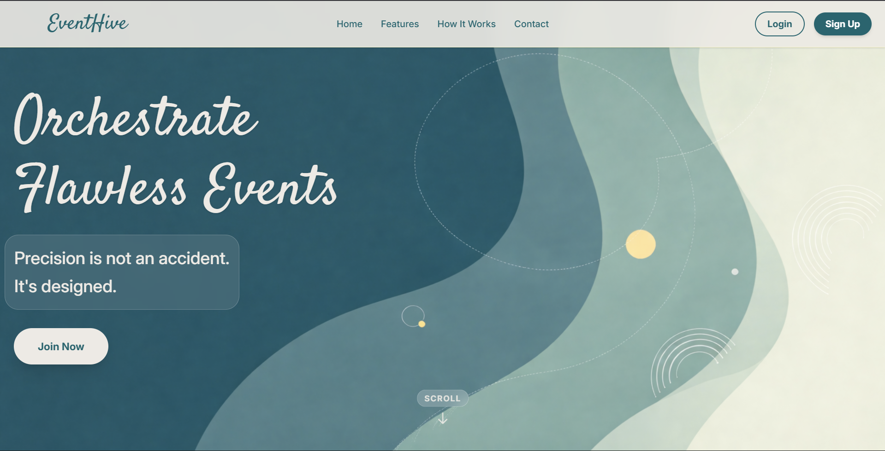

<div align="center">



<br/><br/>

<h1><samp>EventHive</samp></h1>

<p><i>Operations-first event platform — built for organizers, volunteers, and clients.</i></p>

<br/>


</div>

---

<div align="center">

| For Volunteers | For Organizers | For Clients |
|:---:|:---:|:---:|
| Browse & enroll in events | Create events with full role setup | Browse verified organizers |
| Pick roles, track applications | Manage volunteers & offers | Send offers with budget & brief |
| Earn XP, ranks & badges | Analytics — KPIs, charts, trends | Rate organizers after events |
| Build a profile with skills | Expense tracking per booking | Track all bookings in one place |

</div>

---

<div align="center">
<h3><samp>No React. No framework. Just fast, clean Vanilla JS.</samp></h3>
<p>Every page is hand-crafted HTML with dynamic rendering driven by fetch + DOM.<br/>Express + MongoDB on the backend. JWT auth with role-based access on every route.</p>
</div>

---

## Quick Start

```bash
git clone https://github.com/Lokesh-916/EventHive.git && cd EventHive
cd server && npm install
cd ../client && npm install
```

`server/.env`
```
MONGODB_URI=mongodb+srv://<user>:<pass>@cluster.mongodb.net/eventhive
JWT_SECRET=your_secret
PORT=5000
```

```bash
node server/server.js        # start server
cd client && npm run dev     # watch Tailwind (separate terminal)
```

```bash
node server/seed.js          # seed events + organizer
node server/seed-analytics.js
```

Open `http://localhost:5000`

---

<div align="center">
<sub>© 2026 EventHive — All rights reserved.</sub>
</div>
